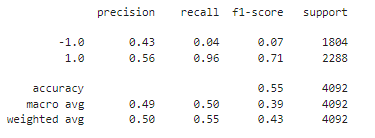
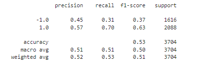
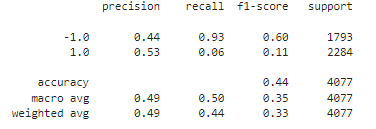
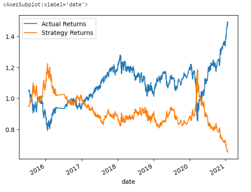
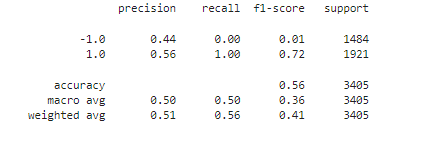
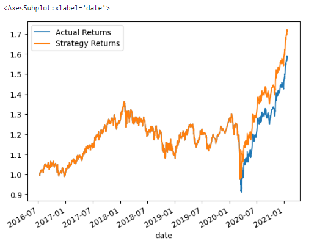
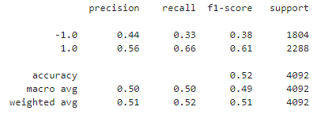
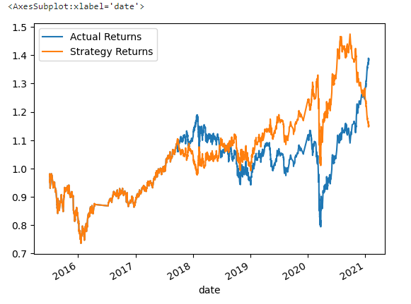

# Module-14-Homework

## Analysis of the Actual Returns vs. SVC Model

```python
short_window = 4
long_window = 100
DateOffset = 3 months
```

The accuracy for the SVM model was 0.55. There was a high recall value of .96 for our sell value which is represented by 1.The high recall for our sell value of 1 represents oru model is predicting correctly but our percision is lower than our recall value leading to a f1-score of .71.



Upon reviewing the comparison of the cumulative returns for actual returns versus the SVC model predictions, the SVC model pulls ahead or outfits at 1.517 versus the 1.386.


## Analysis of Actual Returns vs. Tuned Machine Learning Bot Returns

### Step 1:Tune the Training Algorithm: Slice the Data into Different Periods

```python
short_window = 4
long_window = 100
Dateoffset = 9 months
```

Review the results from changing the periods in relation to the training and testing data can be seen in testing and testing sets can in the Percision Table and Cumulative Returns Plot.




Shifting the SVC model time period or Dateoffset resulted in an accuracy of .53 meaning the cumulative perofrmance of the strategy would not show improvment with the tuned ML. 

The tunning decreased the cumulative performance to 1.625 in comparison to the actual returns at 1.646.

### Step 2: Tune the Training Algorithm: Adjust the SMA Input Features

```python
short_window = 5
long_window = 135
Dateoffset = 3 months
```

Review the results from adjusting the SMA input features in relation to the training and testing data can be seen in testing and testing sets can in the Percision Table and Cumulative Returns Plot.





Increasing the SMA input features depleted the performance of the SVC model with an accuracy of .44 resultingi an underperformance of the strategy returns at .653 in comparison to actual returns at 1.490.

### Step 3: Shift Parameters for Best Improvements of the Trading Algorithm Returns

```python
short_window = 30
long_window = 130
Dateoffset = 15 months
```

Review the results from adjusting the SMA input features and shifting the time period/Dateoffset in relation to the training and testing data can be seen in testing and testing sets can in the Percision Table and Cumulative Returns Plot.





Increasing the SMA input features and the Dateoffset resulted in large improvements of the SVC machine learning model with a accuracy of .56 and high recall for our sell value at 1.00.

The cumulative performance of the SVM strategy results in an overperofmance using the above parameters with returns at 1.718 and actual returns 1.588.

### Step 4: Backtest the New Model Using Logistic Regression

```python
short_window = 4
long_window = 100
DateOffset = 3 months
```





The logistic return model has a accuracy of .52 which is lower than the SVM Model. In fact, the logistic regression model has lower recall and f1-scores for our sell value. On the other hand the buy value of -1 has higher recall at .33 and f1-score at .38 which reflects more accuraet predictions of the logistc return model.

In fact the logistic regression model outperforms with  strategy returns at 1.517 in comparison to the actual reutrns at  1.386.

## Conclusions

In conclusion, the SVM Model with adjusted SMA features and time periods results in higher returns of  1.718 even in comparison to the Logistic Regression Model at 1.517.

It effective to consider the SVM Model with the shifted parameters for the long-short algorithm trading strategy.
